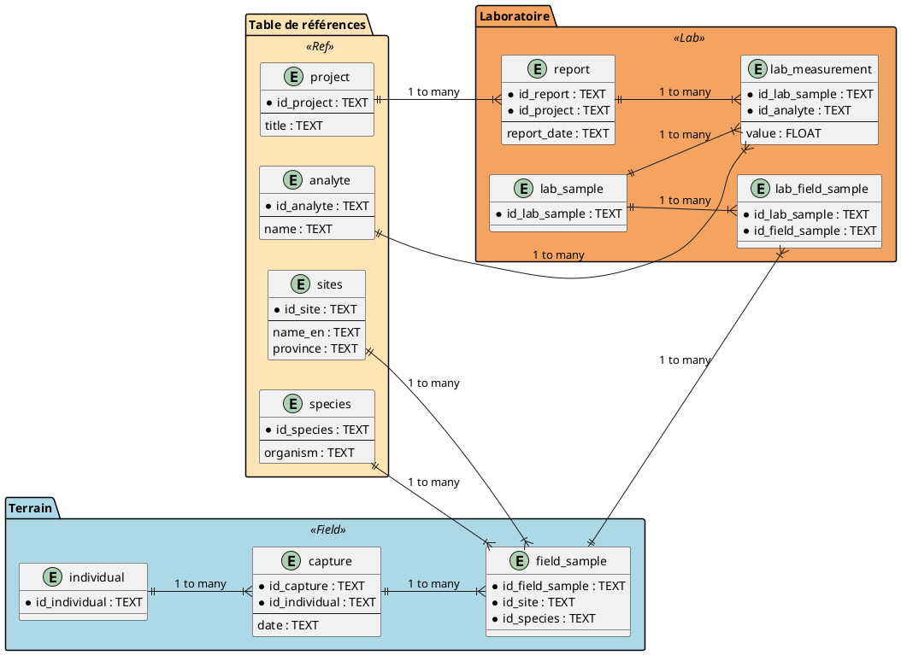
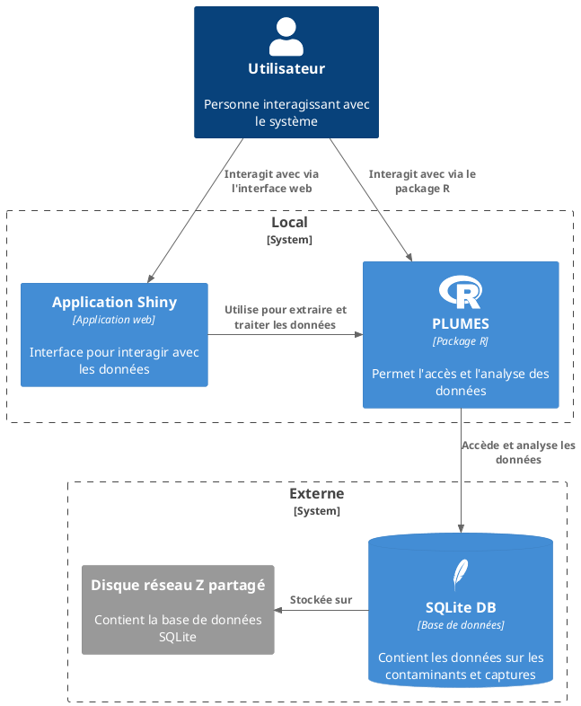
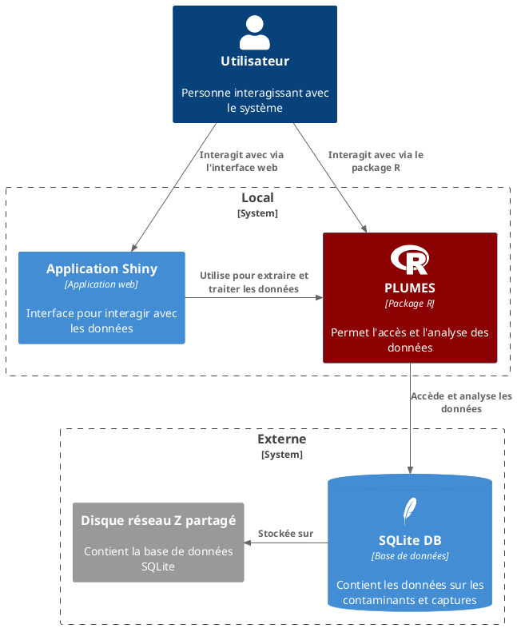

class: title-slide, middle
background-image: url(img/gannet.jpg)

</img>


# Introduction à la base de données **PLUMES**

.instructors[
  Steve Vissault </br>
  `r format(Sys.time(), '%B %d, %Y')`
  
]

<div style="font-size:15px;text-align:right;">Crédit photo: Antanasc</div>

```{r setup, include = FALSE}
knitr::opts_chunk$set(
  comment = "#>>",
  collapse = TRUE,
  warning = FALSE,
  message = FALSE,
  fig.width = 7,
  fig.height = 5.25,
  fig.align = 'center',
  width = 120
)
mypar <- list(fg = "#37abc8", bg = "transparent", las = 1)
library(icons)
```

---

class: inverse, center, middle

# Partie 1


## Vue d'ensemble de la solution

---

# Structure de la base de données

## 3 grandes familles de données

1. Évenements de capture d'individus & Mesures morphométriques sur les individus (Biologiste)
2. Collecte des échantillons (Biologiste)
3. Mesures de contaminants (Chimiste)

---

# Structure de la base de données

Comment cette information est structuré dans la base de données?

```{r, echo=FALSE, out.width="70%"}

```

Diagramme complet accessible [en ligne](https://github.com/ECCC-lavoie-ecotox/pres_plumes/blob/main/hygge/img/db.png)

---

# Outils à notre disposition

```{r, echo=FALSE, out.width="50%"}

```

---

# Base de données

**Où est la base de données?**

- Sur le disque réseau `Z:` dans le dossier  `07-Données BD/Database/`
- La base de données est intitulé `contaminants-rlavoie-eccc.sqlite`

Il faut donc être connecté au `Z:` pour pouvoir accéder aux données

**Versionnage**

Dans le dossier, on retrouve des sauvegardes dans le temps. 
Exemple: `contaminants-rlavoie-eccc-14102024.bak.sqlite`

---

# Outils à notre disposition

On peut interagir avec la base de données de deux manières

1. **Package R:** De manière programmatique (Librairie R)
   - Permet l'écriture et la lecture des données dans la base de données
2. **Application Shiny:** Par une interface utilisateur (UI, application shiny)
   - Permet de rechercher et d'extraire les données selon des filtres contextuels

Ces deux outils se retrouvent dans le package plumesbox
Le code source est disponible sur [Github](https://github.com/ECCC-lavoie-ecotox/plumesbox/tree/master).

---
# Limites technologiques 

| **Avantages**               | **Inconvénients**            |
|-----------------------------|------------------------------|
| Simple à utiliser            | Pas adapté aux très gros volumes de données |
| Flexible pour analyser les données | Performances limitées sur de grands projets  |
| Facile à transporter (SQLite) | Moins sécurisé sur un disque partagé  |
| Coût faible                  | Problèmes possibles avec plusieurs utilisateurs en même temps |

---
# Limites technologiques 

Pour simplifier, qu'est ce que ces limites impliques dans votre quotidien?

**SQLite:** La base de donnée étant contenu dans un fichier, il est impossible d'écrire en même temps sur la base de données (ex. Importer des données). Il est cependant possible d'interroger la base de données simultanément.

--

**Disque réseau Z:** La base de données est plus lente à interroger dû à la latence: On passe par le réseau central à Ottawa (via le VPN ou même au bureau).


---

# Outils à notre disposition

```{r, echo=FALSE, out.width="50%"}

```

---

class: inverse, center, middle

# Partie 2


## Le package R - plumesbox


---
# Installation de `plumesbox`

```{R, eval = FALSE}
install.packages("devtools")
devtools::install_github("ECCC-lavoie-ecotox/plumesbox")
```
Documentation disponible à cette adresse: https://eccc-lavoie-ecotox.github.io/toxbox/

---
# Format more

.pull-left[

#### Classes

normal size ( $\LaTeX$-friendly terms)

`.huge[huge]` &nbsp; .huge[huge]

`.Large[Large]` &nbsp; .Large[Large]

`.large[large]` &nbsp; .large[large]

`.small[small]` &nbsp; .small[small]

`.tiny[tiny]` &nbsp; .tiny[tiny]

`.sotiny[sotiny]` &nbsp; .sotiny[sotiny]

`.font120[font 120%]` &nbsp; .font120[font 120%]

]


.pull-right[

#### Special class

- `.alert[alert]` .alert[alert]

- `.comment[comment]` .comment[comment]

#### Use remarkjs's macros

- `` to scale an image

- `` &nbsp; 

]

???
Macros are easy to create


---
class: inverse, center, middle

# Use R!

## Few examples

---
# One call

```{r}
rnorm(88)
```

---
# Highlight your code


```{r results = "hold"}
val <- 2
{{ val*val }}
val2 <- 5
{{ val2 }}
```

---

# Widget example

```{r, message = FALSE, fig.width = 9, fig.height = 5.4}
library(mapview)
mapview(breweries)
```

---
# Custom plot 

```{r, echo = F, fig.align = "center"}
seqx <- seq(0,10, length = 100)
par(mypar)
par(bty = "l")
plot(seqx, cos(seqx), type = "l", lwd = 4)
abline(v = 6, h = 0, col = "#3fb3b2", lty = 2)
```


# Resources

- Github repository: https://github.com/rstudio/bookdown
- Bookdown book: https://bookdown.org/yihui/bookdown/

