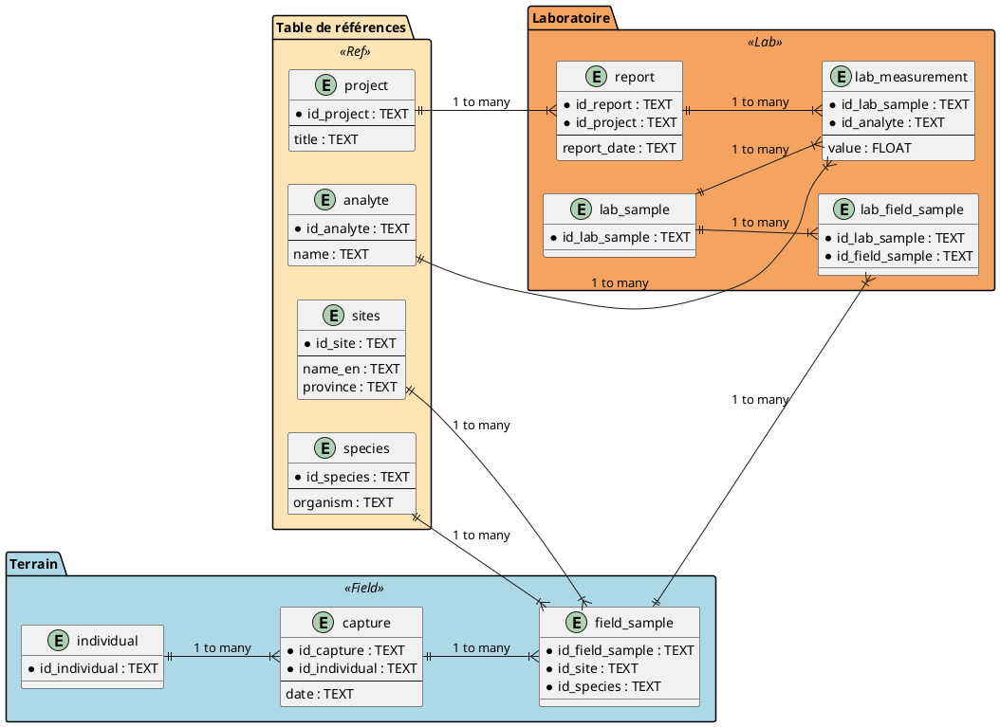
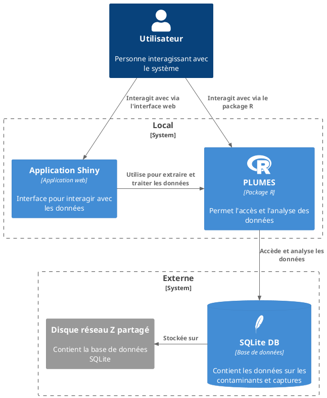
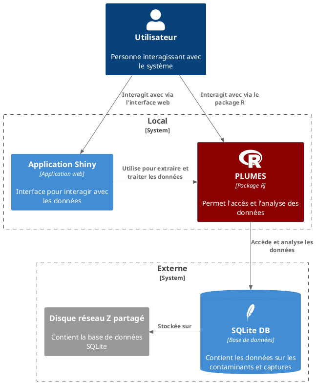
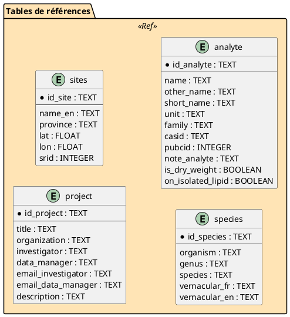

class: title-slide, middle
background-image: url(img/gannet.jpg)

</img>


# Introduction à la base de données **PLUMES**

.instructors[
  Steve Vissault </br>
  `r format(Sys.time(), '%B %d, %Y')`
  
]

<div style="font-size:15px;text-align:right;">Crédit photo: Antanasc</div>

```{r setup, include = FALSE}
knitr::opts_chunk$set(
  comment = "#>>",
  collapse = TRUE,
  warning = FALSE,
  message = FALSE,
  fig.width = 7,
  fig.height = 5.25,
  fig.align = 'center',
  width = 120
)
mypar <- list(fg = "#37abc8", bg = "transparent", las = 1)
library(icons)
```

---

class: inverse, center, middle

# Partie 1


## Vue d'ensemble de la solution

---

# Structure de la base de données

## 3 grandes familles de données

1. Évenements de capture d'individus & Mesures morphométriques sur les individus (Biologiste)
2. Collecte des échantillons (Biologiste)
3. Mesures de contaminants (Chimiste)

---

# Structure de la base de données

## Comment cette information est structuré dans la BD?

```{r, echo=FALSE, out.width="70%"}

```

Diagramme complet accessible [en ligne](https://github.com/ECCC-lavoie-ecotox/pres_plumes/blob/main/img/db.png)

---

# Outils à notre disposition

## Comment la solution est architecturé?

```{r, echo=FALSE, out.width="45%"}

```

---

# Base de données

## Où est la base de données?

- Sur le disque réseau `Z:` dans le dossier  `07-Données BD/Database/`
- La base de données est intitulé `contaminants-rlavoie-eccc.sqlite`

Il faut donc être connecté au `Z:` pour pouvoir accéder aux données

**Versionnage**

Dans le dossier, on retrouve des sauvegardes dans le temps. 
Exemple: `contaminants-rlavoie-eccc-14102024.bak.sqlite`

---

# Outils à notre disposition

On peut interagir avec la base de données de deux manières

1. **Package R:** De manière programmatique (Librairie R)
   - Permet l'écriture et la lecture des données dans la base de données
2. **Application Shiny:** Par une interface utilisateur (UI, application shiny)
   - Permet de rechercher et d'extraire les données selon des filtres contextuels

**Ces deux outils se retrouvent dans le package `plumesbox`.**

Le code source est disponible sur [Github](https://github.com/ECCC-lavoie-ecotox/plumesbox/tree/master).

---
# Limites technologiques 

| **Avantages**               | **Inconvénients**            |
|-----------------------------|------------------------------|
| Simple à utiliser            | Pas adapté aux très gros volumes de données |
| Flexible pour analyser les données | Performances limitées sur de grands projets  |
| Facile à transporter (SQLite) | Moins sécurisé sur un disque partagé  |
| Coût faible                  | Problèmes possibles avec plusieurs utilisateurs en même temps |

---
# Limites technologiques 

## Qu'est ce que ces limites impliques dans votre quotidien?

**SQLite:** La base de donnée étant contenu dans un fichier, il est impossible d'écrire en même temps sur la base de données (ex. Importer des données). Il est cependant possible d'interroger la base de données simultanément.

--

**Disque réseau Z:** La base de données est plus lente à interroger dû à la latence: On passe par le réseau central à Ottawa (via le VPN ou même au bureau).


---

# Outils à notre disposition

```{r, echo=FALSE, out.width="50%"}

```

---

class: inverse, center, middle

# Partie 2


## Le package R - plumesbox

---
# Installation de `plumesbox`

```{R, eval = FALSE}
install.packages("devtools")
devtools::install_github("ECCC-lavoie-ecotox/plumesbox")
```
Documentation du package disponible à cette adresse: https://eccc-lavoie-ecotox.github.io/toxbox/

---

class: inverse, center, middle

# Pratique


## Installer le package plumesbox


---
# Instancier une connexion vers la BD

```{R, echo = FALSE}
con <- plumesbox::init_con(local = "contaminants-rlavoie-eccc.sqlite")
```
On ouvre la connexion vers la base de données

```{R, eval = FALSE}
con <- plumesbox::init_con()
```

On peut valider que la connexion est fonctionnelle

```{R}
DBI::dbListTables(con)
```

---

class: inverse, center, middle

# Pratique


## Valider que la connexion est fonctionnelle de votre côté

---
# Tables de références

.pull-left[
```{r, echo=FALSE, out.width="100%"}

```
]

.pull-right[
  Il existe 4 tables de références dans la base de données:

  1. Sites
  2. Espèces 
  3. Contaminants
  4. Projects
]

---
# Obtenir une table de référence

On réutilise toujours l'objet de connexion que l'on passe à la fonction `plumesbox::get_tbl()` et on spécifie l'argument `tbl` pour obtenir la table désirée.
```{R}
species <- plumesbox::get_tbl(con, tbl = "species")
```

```{R, echo = FALSE}
rmarkdown::paged_table(species, options = list(rows.print = 5))
```

---

class: inverse, center, middle

# Pratique


## Charger dans R les tables de référence analyte et sites

---
# Obtenir la table de référence sites

```{R}
sites <- plumesbox::get_tbl(con, tbl = "sites")   
```

```{R, echo = FALSE}
rmarkdown::paged_table(sites, options = list(rows.print = 5))
```

---
# Cartographie des sites

```{R, out.width = "100%"}
sites <- plumesbox::get_tbl(con, tbl = "sites")   

sites |>
  dplyr::filter(!is.na(lat) | !is.na(lon)) |>
  sf::st_as_sf(coords = c("lon", "lat"), crs = 4326) |>
  mapview::mapview()
```

---
# Obtenir les mesures de contaminants

Afin de simplifier les étapes de jointures entre les tables, il existe une fonction générique dans le package qui permet de récupérer l'ensemble des entrées dans la base de données. 

```{R}
db_plumes <- get_db(con) |> head(100) |> as.data.frame()
```

```{R, echo = FALSE}
rmarkdown::paged_table(db_plumes, options = list(rows.print = 5))
```

---
# Obtenir les mesures de contaminants

On peut par la suite filtrer pour obtenir seulement les mesures désirées.

```{R}
db_plumes <- get_db(con)

bonaventure <- db_plumes |>
  dplyr::filter(id_site == "Bonaventure") |>
  as.data.frame()
```

```{R, echo = FALSE}
rmarkdown::paged_table(bonaventure, options = list(rows.print = 5))
```

---

class: inverse, center, middle

# Pratique


## Obtenir les mesures pour un contaminant en particulier

---

class: inverse, center, middle

# Partie 3


## Importer des données

---
# Ordre d'injection

## Tables de références

Les tables de référence sont à insérer en premier car elles fournissent des informations pour les autres tables:
   - **sites** : Remplir en premier pour les informations sur les sites.
   - **species** : À insérer avant les échantillons de terrain (`field_sample`).
   - **analyte** : Nécessaire pour les mesures de laboratoire (`lab_measurement`).
   - **project** : Utilisée dans les rapports (`report`).

---
# Ordre d'injection

## Terrain

Ensuite, les données de terrain :
 - **individual** : Remplir avant les captures.
 - **capture** : Nécessaire pour les échantillons de terrain.
 - **field_sample** : Reliée à sites, species et capture, donc ces tables doivent être déjà remplies.

Note: Pour la plupart des cas, seulement les informations sur le field sample sont à renseigner.

---
# Ordre d'injection

## Laboratoire

Une fois les données de référence et de terrain injectées :
   - **lab_sample** : À insérer avant les mesures.
   - **report** : À injecter après les projets.
   - **lab_field_sample** : Fait le lien entre `field_sample` et `lab_sample`.
   - **lab_measurement** : Insérée en dernier, dépend de `lab_sample`, `analyte` et `report`.
